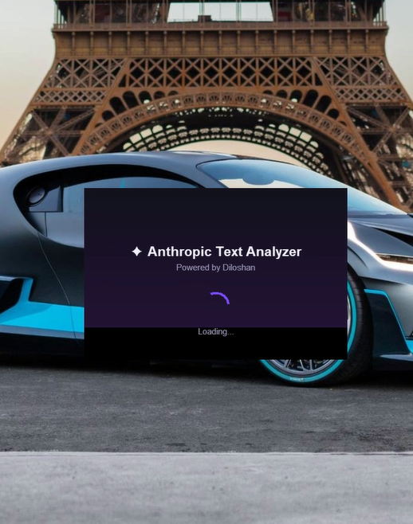

<div align="center">

# 🍎 macOS Anthropic Text Analyzer — App Builder

**A standalone macOS dark-themed GUI application built with Python & CustomTkinter,
that analyzes `.txt` files using the Anthropic Claude API.**


</div>

---

## 📖 Table of Contents

- [About](#-about)
- [Key Features](#-key-features)
- [Tech Stack](#️-tech-stack)
- [Project Structure](#-project-structure)
- [Quick Start Guide](#-quick-start-guide)
- [Building a Standalone macOS App](#-building-a-standalone-macos-app)
- [License](#-license)

---

## 📝 About

This app packages a working Python + Claude API text-analysis script into a
simple, double-clickable desktop tool — no terminal or code editing required
to use it. Users enter their own Anthropic API key, pick a `.txt` file, and
get an instant AI-generated analysis.

<div align="center">
  
</div>

---

## ✨ Key Features

| | Feature | Description |
|---|---|---|
| 🔑 | **In-App API Key Entry** | Enter your Anthropic API key directly in a masked input field — nothing hardcoded. |
| 📄 | **Simple File Picker** | Select any `.txt` file through a native macOS file dialog. |
| 🤖 | **Claude-Powered Analysis** | Sends file content to the Claude API and returns a concise analysis. |
| ⚡ | **Non-Blocking UI** | API calls run on a background thread with a progress indicator, so the app never freezes. |
| 🎨 | **Dark Mode UI** | Clean, modern dark interface built with `CustomTkinter`. |
| 🛡️ | **Friendly Error Handling** | Clear messages for missing keys, bad files, invalid keys, or connection issues. |

---

## 🛠️ Tech Stack

| Component | Technology / Library |
| :--- | :--- |
| **Language** | Python 3.x |
| **GUI Framework** | `CustomTkinter` |
| **AI Provider** | Anthropic Claude API (`anthropic` SDK) |
| **Packaging** | `PyInstaller` |

---

## 📂 Project Structure

```text
macOS-Anthropic-Text-Analyzer-App-Builder/
├── app.py              # Main application code (GUI & logic)
├── Requirements.txt    # Required Python packages
├── image.png           # Application GUI Preview
└── README.md           # Project documentation
